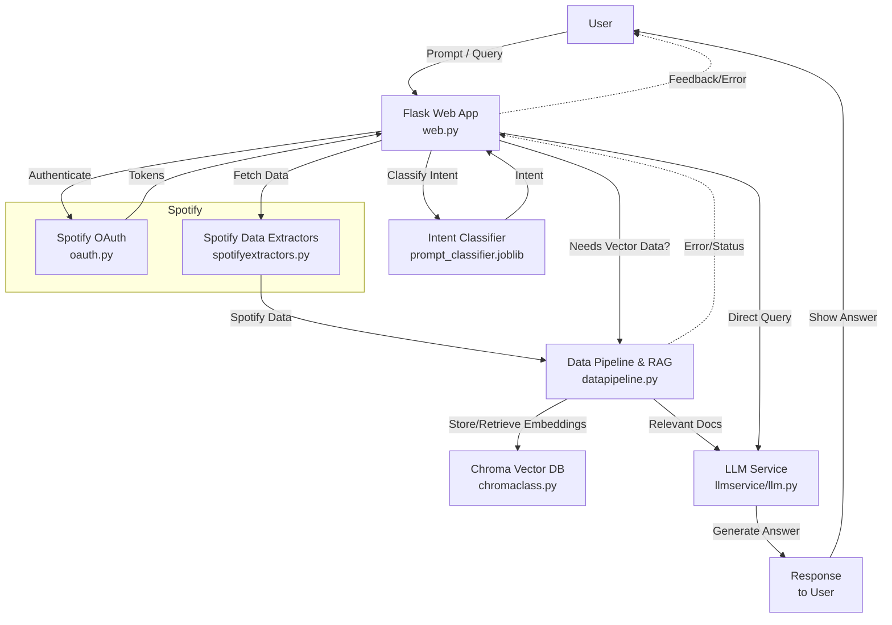

# SpotRAG

**SpotRAG** is an AI-powered music assistant that utilizes Spotify data and Retrieval-Augmented Generation (RAG) to answer in-depth questions about songs, artists, and genres. Designed for speed, intelligence, and conversational interaction, SpotRAG offers a seamless experience for music enthusiasts.

## Features

- **Conversational Music Queries**: Engage in natural language conversations to explore music-related information.
- **Deep Insights**: Obtain detailed answers about songs, artists, and genres using advanced AI techniques.
- **Spotify Integration**: Leverage Spotify's extensive music data for accurate and up-to-date information.
- **Fast and Smart Responses**: Experience quick and intelligent answers powered by RAG.

## Getting Started

*Note: The following setup instructions are based on standard practices, as specific details are not provided in the repository.*

### Prerequisites

- Python 3.7 or higher
- Spotify Developer Account (for API access)
- [Flask](https://flask.palletsprojects.com/) web framework

### Installation

1. **Clone the Repository**
   ```bash
   git clone https://github.com/jerrygeorge360/SpotRAG.git
   cd SpotRAG
   ```

2. **Create a Virtual Environment**
   ```bash
   python -m venv venv
   source venv/bin/activate  # On Windows: venv\Scripts\activate
   ```

3. **Install Dependencies**
   ```bash
   pip install -r requirements.txt
   ```

4. **Set Environment Variables**
   Create a `.env` file in the root directory and add your Spotify API credentials:
   ```env
   SPOTIFY_CLIENT_ID=your_client_id
   SPOTIFY_CLIENT_SECRET=your_client_secret
   ```

5. **Run the Application Locally**
   ```bash
   flask run
   ```

   The application will be accessible at `http://localhost:5000`.


## Architecture



## Project Structure

- `main.py`: Entry point of the application.
- `spotifyextractors.py`: Handles data extraction from Spotify.
- `datapipeline.py`: Manages data processing and RAG implementation.
- `templates/`: Contains HTML templates for the web interface.
- `static/`: Holds static files like CSS and JavaScript.

## License

This project is licensed under the MIT License. See the [LICENSE](https://github.com/jerrygeorge360/SpotRAG/blob/main/LICENSE) file for details.

## Contributing

Contributions are welcome! Please fork the repository and submit a pull request for any enhancements or bug fixes.
